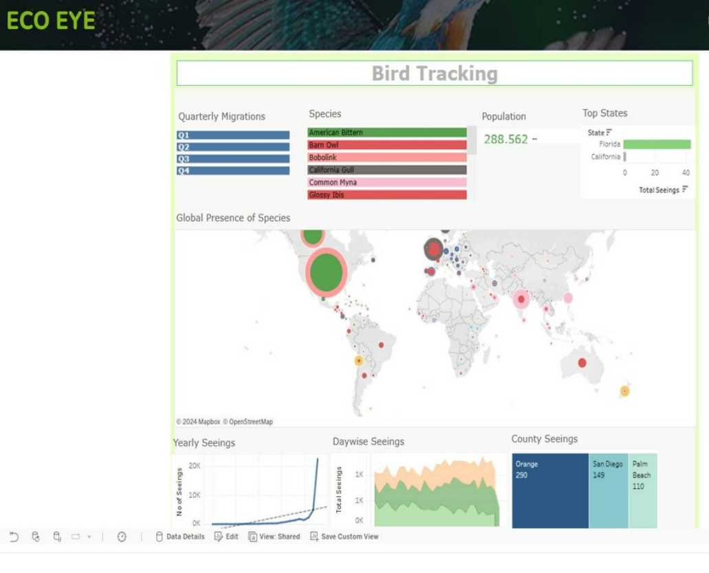

<div align="center">

# EcoEye — Bird Monitoring System

### Data Pipeline · Species Classification · Conservation Analytics

[](https://python.org)
[](https://tensorflow.org)
[](https://powerbi.microsoft.com)

*Built as part of the EcoEye Online Bird Monitoring System · Loyalist College, AI & Data Science Program*

</div>

---

## Dashboard Preview



> Bird Tracking Dashboard — global species presence map, quarterly migration trends, population analytics, and county-level sighting breakdowns built in Power BI.

---

## Project Highlights

<div align="center">

| Dataset | Model Accuracy | Countries | Species |
|:---:|:---:|:---:|:---:|
| **288,562 observations** | **97.35%** | **170** | **53 monitored** |

> **Note:** The classification model is a prototype trained on 10 species. The full dataset covers 53 species — the goal is to expand the model to cover all 53 as more labelled data is collected.

</div>

---

## What's in This Repo

This repository covers three components of the EcoEye project:

| # | Component | Description |
|---|---|---|
| 1 | **Data Pipeline** | Selenium scraper collecting bird images from iStock & eBird across 53 species |
| 2 | **ML Classification** | EfficientNetB0 transfer learning model — 97.35% accuracy on 10 species |
| 3 | **Power BI Dashboard** | Interactive Bird Tracking dashboard with migration trends & global maps |

---

## Repository Structure

```
Bird-Data-Scraping/
├── notebooks/
│   ├── 01_scraping/
│   │   ├── Web Scraping.ipynb                                  # Initial prototype (eBird)
│   │   ├── WebScraping_new.ipynb                               # Improved pagination handling
│   │   ├── Web Scraping with names and datetime(Final).ipynb   # Species-tagged filenames
│   │   └── Final Scraping (Code).ipynb                         # Production scraper
│   └── 02_model/
│       └── Bird_Species_Classification.ipynb                   # EfficientNetB0 (97.35% accuracy)
├── images/
│   └── dashboard_preview.png
├── presentation/
│   └── EcoEye_Presentation.pdf                                 # Final project presentation (15 slides)
├── requirements.txt
├── .gitignore
└── README.md
```

---

## ML Model Performance

EfficientNetB0 transfer learning · Trained on 1,695 labeled images · 10 species

| Species | Precision | Recall | F1-Score |
|---|:---:|:---:|:---:|
| African Emerald Cuckoo | 1.00 | 0.97 | 0.99 |
| African Pied Hornbill | 0.97 | 1.00 | 0.99 |
| Albatross | 0.96 | 1.00 | 0.98 |
| American Bittern | 1.00 | 1.00 | 1.00 |
| Golden Cheeked Warbler | 1.00 | 1.00 | 1.00 |
| Gray Kingbird | 0.97 | 1.00 | 0.98 |
| Long-Eared Owl | 0.97 | 0.90 | 0.93 |
| Myna | 1.00 | 0.97 | 0.98 |
| Razorbill | 0.97 | 0.95 | 0.96 |
| Red Tailed Hawk | 0.91 | 0.95 | 0.93 |
| **Overall** | **0.98** | **0.97** | **0.97** |

### Model Architecture
```
EfficientNetB0 (ImageNet weights, frozen)
        ↓
  Dense(128, ReLU) → Dropout(0.45)
        ↓
  Dense(256, ReLU) → Dropout(0.45)
        ↓
  Dense(10, Softmax)
```
- **Augmentation:** Random flip · Rotation ±10° · Zoom ±10° · Contrast ±10°
- **Callbacks:** EarlyStopping · ModelCheckpoint · ReduceLROnPlateau
- **Interpretability:** Grad-CAM heatmap visualization

---

## Power BI Dashboard Panels

| Panel | Description |
|---|---|
| **Quarterly Migrations** | Q1–Q4 bar chart of seasonal sighting volume |
| **Species Panel** | Population counts — American Bittern, Barn Owl, Bobolink, California Gull, Common Myna, Glossy Ibis |
| **Population Counter** | 288,562 total observations tracked |
| **Global Presence Map** | Bubble map of species sighting density across 170 countries |
| **Yearly Seeings** | Line chart showing observation growth from 1964–2024 |
| **Daywise Seeings** | Area chart of intra-week sighting patterns |
| **Top States / Counties** | Florida · California · Orange (290) · San Diego (149) · Palm Beach (110) |

---

## Tech Stack

| Layer | Tools |
|---|---|
| Data Collection | Python · Selenium · requests |
| Data Processing | pandas · NumPy |
| Machine Learning | TensorFlow · Keras · EfficientNetB0 · scikit-learn · OpenCV |
| Visualization | Power BI · matplotlib · seaborn |
| Environment | Google Colab · Jupyter Notebook |

---

## Getting Started

### 1. Install dependencies
```bash
pip install -r requirements.txt
```

### 2. Run the Scraper
Open `notebooks/01_scraping/Final Scraping (Code).ipynb` and update the `CONFIGURATION` cell at the top — set your species name, page range, and ChromeDriver path.

Download ChromeDriver from [chromedriver.chromium.org](https://chromedriver.chromium.org/)

### 3. Run the Classification Model
Open `notebooks/02_model/Bird_Species_Classification.ipynb` in Google Colab, mount your Google Drive, update the dataset path, and run all cells.

---

## My Contribution

This was a group project. My specific responsibilities:

- **Scraping pipeline** — built and iterated 4 versions of the Selenium scraper for per-species image collection from iStock and eBird
- **Data consolidation** — merged 25+ per-species CSV exports with peer-collected data, resolved naming inconsistencies, standardized schema across 288,562 total observations
- **ML model** — built the EfficientNetB0 classifier (97.35% accuracy) with data augmentation, training callbacks, Grad-CAM interpretability, and single-image prediction
- **Power BI dashboard** — designed the Bird Tracking dashboard with global species presence map, quarterly migration charts, yearly/daywise sighting trends, and county-level breakdowns

---

## Presentation

The final project presentation (15 slides) covering the problem statement, system architecture, live demo, and future developments is available here:
[EcoEye_Presentation.pdf](presentation/EcoEye_Presentation.pdf)

---

## Full Project

The complete EcoEye web application (UI + deployment) is available at:
[github.com/TechnoVishalGirase/EcoEye-Online_Bird_Monitoring_System](https://github.com/TechnoVishalGirase/EcoEye-Online_Bird_Monitoring_System)

---

<div align="center">

*Developed as part of an academic project at Loyalist College, Ontario · [github.com/rkdhakal](https://github.com/rkdhakal)*

</div>
